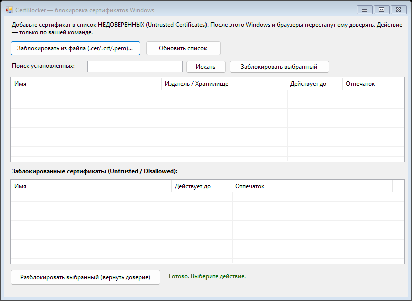

<h1 align="center">🛡️ CertBlocker (без прав администратора)</h1>

<p align="center">
  Простая утилита для Windows, которая по команде пользователя делает выбранный
  сертификат <b>недоверенным</b> — добавляет его в хранилище
  <code>CurrentUser\Disallowed</code> (для текущего пользователя, <b>без UAC</b>).
</p>

<p align="center">
  🔗 Версия с правами администратора (блокировка для всей системы) —
  <a href="https://github.com/1565gfd/CertBlocker">1565gfd/CertBlocker</a>
</p>

<p align="center">
  
  
  
  
</p>

---

## 📖 Что это

**CertBlocker** позволяет заблокировать сертификат (например, корневой центр
сертификации, которому вы не хотите доверять) на своём компьютере. «Блокировка» —
это добавление сертификата в системное хранилище **`Disallowed`** (в оснастке
`certmgr.msc` — «Untrusted Certificates» / «Сертификаты, к которым нет доверия»).

После этого сертификату перестают доверять Windows и все программы, использующие
системное хранилище: **Microsoft Edge, Google Chrome, Internet Explorer, .NET** и др.
Firefox использует **собственное** хранилище и на эту настройку не реагирует.

> ⚠️ **Всё происходит только по вашей команде.** Приложение ничего не блокирует
> автоматически — каждое действие выполняется по нажатию кнопки.

---

## 🖼️ Как выглядит

<p align="center">
  
</p>

---

## ✨ Возможности

- 🔒 **Заблокировать из файла** — выбрать `.cer` / `.crt` / `.der` / `.pem` и сделать его недоверенным.
- 🔦 **Поиск** по имени среди установленных корневых сертификатов и блокировка выбранного.
- 📋 **Список заблокированных** и кнопка **разблокировать** (вернуть доверие) с подтверждением.

---

## 🚀 Запуск

1. Скачайте `CertBlocker.exe` из раздела **[Releases](../../releases)**.
2. Запустите двойным кликом — **права администратора не нужны**. Сертификат
   становится недоверенным для **текущего пользователя** (хранилище
   `CurrentUser\Disallowed`).
3. При предупреждении **SmartScreen**: **«Подробнее» → «Выполнить в любом случае»**
   (см. раздел ниже).

---

## ✅ Про предупреждение SmartScreen — всё в порядке

При первом запуске Windows может показать синее окно
**«Windows защитила ваш компьютер»**. Это **нормально и не означает вирус**.

**Почему оно появляется:** SmartScreen предупреждает про **любую** программу,
которая скачана из интернета и **не подписана платным сертификатом разработчика**
и ещё не набрала «репутацию» у Microsoft. У маленьких open-source утилит подписи
обычно нет — предупреждение относится к **отсутствию подписи**, а не к поведению
программы.

**Почему этому проекту можно доверять:**
- 📂 **Открытый исходный код** — весь код в этом репозитории ([`src/Program.cs`](src/Program.cs)), можно прочитать и **собрать самому** (см. «Сборка из исходников»).
- 🌐 **Нет сети** — программа никуда не подключается и ничего не отправляет.
- 🚫 **Нет внешних команд** — не запускает сторонних процессов, не пишет в автозагрузку.
- 🔧 **Единственное действие** — запись в хранилище `CurrentUser\Disallowed`, которую вы отменяете кнопкой «Разблокировать».

**Как запустить:** в окне SmartScreen нажмите **«Подробнее»** → **«Выполнить в любом случае»**.

**Проверка целостности (по желанию).** Убедитесь, что скачанный файл не подменён —
сравните SHA-256:

```powershell
Get-FileHash -Algorithm SHA256 .\CertBlocker.exe
```

Ожидаемое значение для `CertBlocker.exe` из релиза **v1.0.1**:

```
302E8A44D8E272A55BE049283579632CD8F8FC159EE391E92DF58D2D4128A9F5
```

Если хеши совпадают — файл ровно тот, что опубликован здесь. Хотите полностью
исключить любые сомнения — **соберите `.exe` сами** командой из раздела ниже.

---

## 🛠️ Сборка из исходников

Требуется только **Windows** с установленным **.NET Framework 4.x** (есть в системе
по умолчанию) — компилятор `csc.exe` уже присутствует. Отдельный SDK не нужен.

```powershell
# из корня репозитория
powershell -ExecutionPolicy Bypass -File .\build.ps1
```

Скрипт соберёт `build\CertBlocker.exe`. Либо вручную:

```powershell
& "$env:WINDIR\Microsoft.NET\Framework64\v4.0.30319\csc.exe" `
  /target:winexe /out:CertBlocker.exe /win32manifest:src\app.manifest `
  /reference:System.dll /reference:System.Drawing.dll `
  /reference:System.Windows.Forms.dll /reference:System.Security.dll `
  /reference:System.Core.dll src\Program.cs
```

---

## 🔐 Безопасность

Приложение работает **без прав администратора**; тем не менее в код заложены защитные меры:

| Мера | Зачем |
|------|-------|
| **Защита от подмены DLL** (`SetDefaultDllDirectories` + `SetDllDirectory("")`) | Не даёт подгрузить чужую библиотеку из каталога запуска (например, из `Downloads`) — частый вектор атаки на admin-приложения. |
| **Только публичная часть сертификата** | При загрузке файла берётся `RawData` — приватный ключ из `.pfx` не сохраняется на диск. |
| **Освобождение ресурсов** | Объекты сертификатов освобождаются (`Dispose`), в списке хранится только отпечаток. |

Приложение **не** выходит в сеть, **не** выполняет внешних команд и **не** собирает
никаких данных. Единственное изменение в системе — запись в хранилище
`CurrentUser\Disallowed`, которую вы в любой момент отменяете кнопкой
«Разблокировать».

---

## ↩️ Как вернуть доверие

Выберите сертификат в нижнем списке «Заблокированные» → **«Разблокировать выбранный»**.
Либо вручную: `certmgr.msc` → «Сертификаты, к которым нет доверия» → удалить запись.

---

## 📄 Лицензия

[MIT](LICENSE) — используйте свободно.

---

<p align="center"><sub>Утилита для личного использования на собственном устройстве. Вы сами решаете, каким центрам сертификации доверять.</sub></p>
